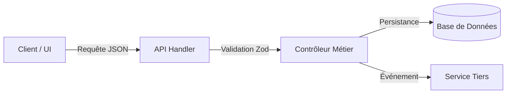

# Skill : auto-documentation (V1.0)
Consignation continue des décisions d'architecture, des flux fonctionnels et de l'état technique dans la mémoire vivante du projet.

---

## 1. Les 3 Livrables de l'Auto-Documentation

1. **Architecture Decision Record (ADR)** : Pourquoi on a choisi cette lib/solution plutôt qu'une autre.
2. **Diagramme de Flux Mermaid** : Visualisation claire des échanges entre Frontend, Backend, API et BDD.
3. **Journal des Changements Techniques (Living Changelog)** : Fichiers modifiés, nouveaux contrats d'API, impact sur l'environnement.

---

## 2. Template d'un ADR Ultra-Condensé (Format Standard)

```markdown
### ADR-[NUMÉRO] : [Titre de la décision]
- **Date** : AAAA-MM-JJ
- **Statut** : Validé / Remplacé / En test
- **Contexte** : Quel était le problème ou le blocage rencontré ?
- **Décision adoptée** : Quelle technologie/approche a été retenue ?
- **Alternatives rejetées** : Pourquoi l'alternative X ou Y n'a pas été retenue ?
- **Conséquences** : Impact direct sur la stack ou les performances.
```

---

## 3. Exemple de Cartographie Visuelle Mermaid Obligatoire

Pour tout changement architectural, insérer un schéma de flux :



---

## 4. Règles d'Exécution

- **Mise à jour incrémentale** : Ne jamais écraser l'historique. Ajouter les nouvelles décisions sous forme de blocs datés dans `contexte.md` ou un dossier `docs/adr/`.
- **Zéro jargon spéculatif** : Documenter uniquement ce qui est implémenté et testé (pas de suppositions futures).
- **Règle d'arrêt** : Dès que les blocs de documentation sont écrits, terminer immédiatement sans bavardage.
