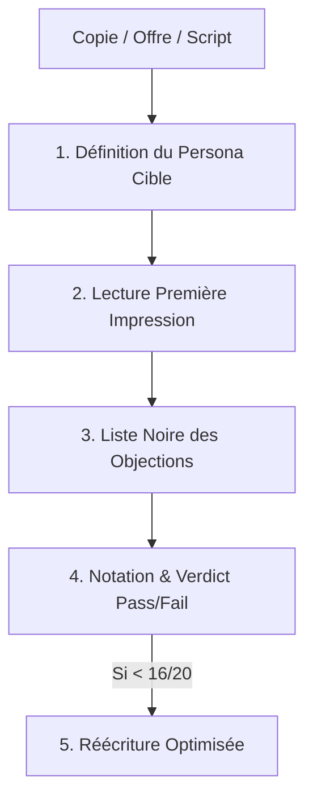

# Skill : icp-simulator (V1.0)
Laboratoire de pré-validation marketing et produit : confronter vos textes, offres et scripts à des personas d'acheteurs simulés sans complaisance.

---

## 1. Principe de la Simulation par Personas Défiants

L'écueil numéro 1 d'une IA classique est la flagornerie (*« Bravo, ton offre est géniale ! »*).
Ce skill force les sous-agents persona à adopter la posture **sceptique, pressée et réaliste** d'un vrai décideur ou consommateur :
- Ils n'ont **pas de temps**.
- Ils ont déjà vu **10 offres similaires** cette semaine.
- Ils cherchent immédiatement le **piège, le coût caché ou le flou**.

---

## 2. Grille de Score ICP (Sur 20 points)

Pour chaque test, le sous-agent persona évalue le livrable selon 4 piliers (5 points chacun) :

1. **Clarté Immédiate (Hook & Compréhension en 5 secondes)** : Est-ce qu'on comprend en une phrase ce que ça m'apporte ?
2. **Pertinence de la Douleur (Pain Point Fit)** : Est-ce que ça résout un vrai problème qui m'empêche de dormir ou un faux besoin ?
3. **Crédibilité & Confiance** : Preuves, garanties, réalisme de la promesse (absence de promesse magique ridicule).
4. **Friction à l'Action (CTA)** : Est-ce que le passage à l'action est simple, clair et sans risque ?

---

## 3. Workflow de Test & Itération



### Format du Rapport de Simulation

```markdown
### 👤 Persona Simulé : [Poste, Secteur, Niveau de revenu / maturité]

#### 🎯 Première Impression (Brutale et honnête)
> "[Ce qui traverse l'esprit du prospect après 5 secondes de lecture]"

#### 🛑 Les 3 Objections Majeures Détectées
1. **Objection 1 (Prix / Risque)** : ...
2. **Objection 2 (Clarté / Jargon)** : ...
3. **Objection 3 (Manque de preuve)** : ...

#### 📊 Score de Conversion : XX / 20
- Clarté : X/5 | Douleur : X/5 | Crédibilité : X/5 | Action : X/5

#### 💡 Version Corrigée (Itération Recommandée)
[Texte ou offre réécrit en désamorçant chacune des 3 objections]
```
