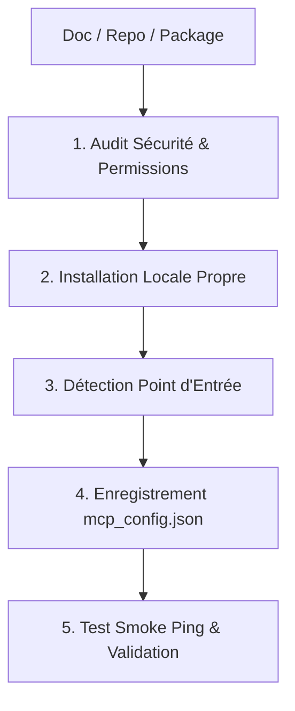

# Skill : mcp-installer (V1.0)
Automatisation complète de l'intégration, de l'audit de sécurité et du déploiement de serveurs Model Context Protocol (MCP).

---

## 1. Protocole d'Installation en 5 Étapes



### Étape 1 : Audit de Sécurité Préalable
- Vérifier la provenance du serveur (repo officiel vs package non maintenu).
- Scanner les dépendances avec `npm audit` ou inspection du code source.
- Identifier les permissions requises (réseau, disque, variables d'environnement sensibles).

### Étape 2 : Installation Permanente
- Ne jamais dépendre d'un cache temporaire volatile (type `_npx`).
- Installer globalement ou dans le répertoire permanent des modules MCP :
  `AppData/Local/Programs/nodejs/node_modules/<package>` ou build local propre.

### Étape 3 : Identification du Point d'Entrée
- Repérer le fichier binaire ou d'exécution exact (`dist/index.js`, `build/index.js`, `dist/cli.js`).
- Vérifier la compatibilité des chemins Windows (antislashs vs forward-slashs).

### Étape 4 : Déclaration dans `mcp_config.json`
- Mettre à jour `mcp_config.json` avec la structure standard :
```json
"<nom-serveur>": {
  "command": "C:/Users/<User>/AppData/Local/Programs/nodejs/node.exe",
  "args": [
    "C:/chemin/vers/package/dist/index.js"
  ],
  "env": {
    "CLE_API": "valeur"
  }
}
```

### Étape 5 : Test Smoke & Validation
- Tester l'exécution du point d'entrée avec `--help` ou `ping`.
- Vérifier que le serveur répond aux requêtes JSON-RPC via stdio sans crash.
- Mettre à jour le fichier de documentation des outils disponibles.
